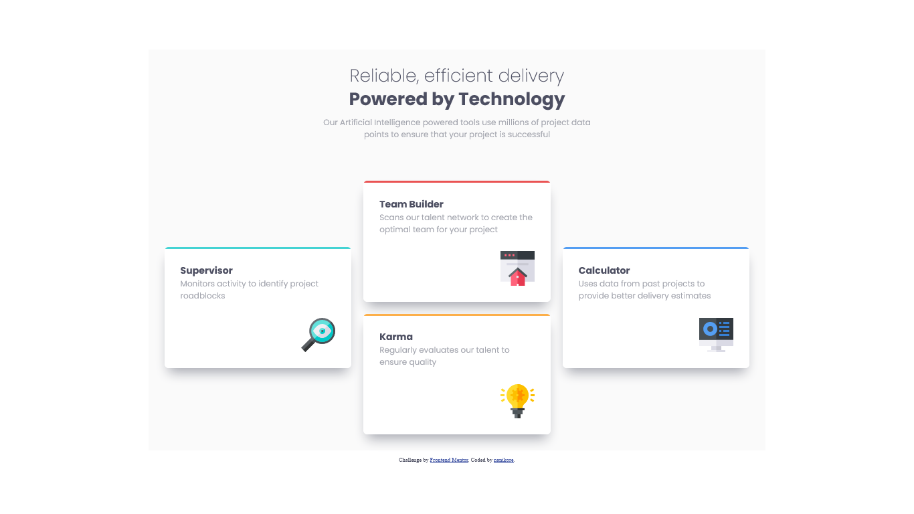

# Frontend Mentor - Four card feature section solution

This is a solution to the [Four card feature section challenge on Frontend Mentor](https://www.frontendmentor.io/challenges/four-card-feature-section-weK1eFYK). Frontend Mentor challenges help you improve your coding skills by building realistic projects.

## Table of contents

- [Overview](#overview)
  - [The challenge](#the-challenge)
  - [Screenshot](#screenshot)
  - [Links](#links)
- [My process](#my-process)
  - [Built with](#built-with)
  - [What I learned](#what-i-learned)
  - [Continued development](#continued-development)
- [Author](#author)

## Overview

### The challenge

Users should be able to:

- View the optimal layout for the site depending on their device's screen size

### Screenshot

### Links

- [Solution URL](https://www.frontendmentor.io/solutions/four-card-feature-section-solution-y7w3gxdwDQ)
- [Live Site URL](https://cdguilherme.github.io/four-card-feature-section-master/)

## My process

### Built with

- Semantic HTML5 markup
- CSS custom properties
- Flexbox
- CSS Grid
- Mobile-first workflow
- [SASS](https://sass-lang.com/) - For styles

### What I learned

This is my first project using SASS, I wanted to give it a try so this project was a great opportunity to learn the fundamentals.

This project was also a great opportunity to learn more about CSS Grid when aligning the cards for desktop view.

### Useful resources

- [Sass in 100 Seconds](https://www.youtube.com/watch?v=akDIJa0AP5c) - This helped me understand the fundamentals of SASS.
- [Sass/SCSS for, each & while loops (Iteration Control) Tutorial](https://www.koderhq.com/tutorial/sass/iteration-control/) - This tutorial helped me with loops using SASS.
- [Learn CSS Grid - A 13 Minute Deep Dive](https://www.youtube.com/watch?v=EiNiSFIPIQE) - This video was super useful when learning about Grid concepts.

## Author

- Github - [Guilherme Costa](https://github.com/cdGuilherme)
- Frontend Mentor - [@cdGuilherme](https://www.frontendmentor.io/profile/cdGuilherme)
